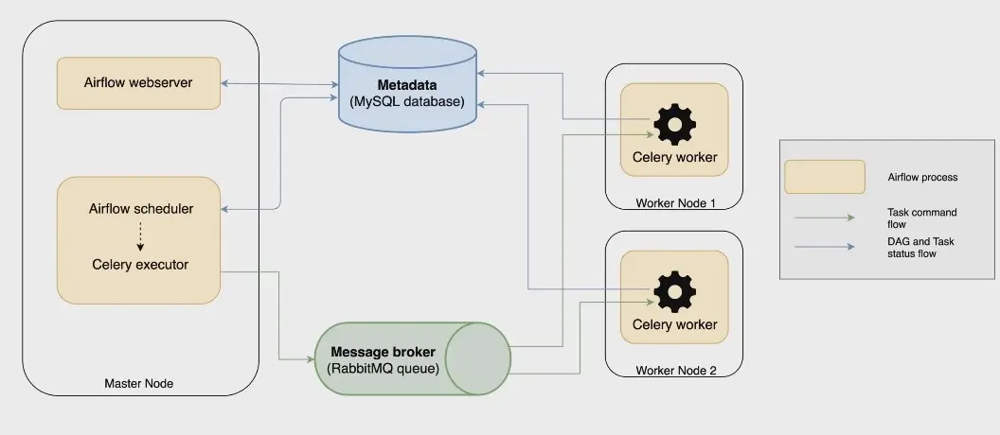

## 前言

Airflow入门教程


## 正文
### 简介
任务管理、调度、监控工作流平台。

基于DAG(有向无环图)的任务管理系统。

### 基本架构



#### 组件
- **scheduler**：
以有向无环图(dag)的形式创建任务工作流，根据用户的配置将任务定时/定期进行调度
- **worker**：
任务的执行单元，worker会从任务队列当中拉取任务并运行任务
- **webserver**：
可视化管理界面，可以配置相关参数和操作dag
- **message queue**：
任务的调度队列，一般使用redis或者rabbitMq作为broker
- **metadata center**：
所有任务、dag、日志的相关元信息均存储于metadata Center，一般使用MariaDB(MySQL)进行metadata管理

#### 调度单元
- **dag**: 
airflow当中work flow的基本单位，通过配置Dag当中的相应参数确定调度时间、调度频率，通过实例化dag当中的task创建实际工作流
- **task**: 
task由operator以及task upstream/downstream两部分组成，airflow提供了非常丰富的operator能够对接各类平台与系统实现任务执行，任务之间通过简单的上下游关系建立关系组成工作流

### 构建任务流

#### **DAG**

设置相关参数，定义一个任务流DAG

#### **示例**
```python
from airflow import DAG
from datetime import datetime, timedelta
from tasks.alert_lark_message.webhook import task_failure_alert

# 统一DAG的初始配置
default_args = {
    'owner': 'wz',
    'depends_on_past': False,
    'email': ['wangzhi@abakusglobal.com'],
    'email_on_failure': False,
    'email_on_retry': False,
    'retries': 0,
    'retry_delay': timedelta(minutes=5),
}

# 实例化DAG
with DAG(
        'demo_dag',
        default_args=default_args,
        description='',
        schedule_interval='0 20 * * *',
        start_date=datetime(2024, 5, 20),
        catchup=False,
        tags=['demo'],
        on_failure_callback=task_failure_alert,
) as dag:
    # 定义任务
    # 定义执行规则
    pass
```

#### **详细参数**
1. **dag_id**
  - 类型: str
  - 描述: DAG 的唯一标识符，用于在 Airflow UI 中标识 DAG。
2. **description**
  - 类型: str
  - 描述: DAG 的描述，有助于其他用户理解 DAG 的用途。
3. **schedule_interval**
  - 类型: datetime.timedelta | str | cron expression
  - 描述: 定义任务执行频率。可以是一个 cron 表达式、timedelta 对象或一个特殊的预设字符串（如 '@daily'、'@hourly'）。
4. **start_date**
  - 类型: datetime.datetime
  - 描述: DAG 的开始日期，不会在这个日期之前执行任何任务。
5. **end_date**
  - 类型: datetime.datetime
  - 描述: DAG 的结束日期，该日期后不再调度任务。
6. **default_args**
  - 类型: dict
  - 描述: 设置默认的任务参数，如重试次数、重试延迟、邮件通知等。
7. **tags**
  - 类型: List[str]
  - 描述: 标签列表，用于在 UI 中更好地组织和查找 DAG。
8. **catchup**
  - 类型: bool
  - 描述: 是否对过去的未执行周期执行补回任务。默认为 True。如果设置为 False，在 start_date 之后启动的 DAG 将不会执行早期周期的任务。
9. **max_active_runs**
  - 类型: int
  - 描述: 同时运行的 DAG 实例的最大数量。
10. **dagrun_timeout**
  - 类型: datetime.timedelta
  - 描述: 每个 DAG 运行的最大持续时间。超时后，DAG 运行会被标记为失败。
11. **on_failure_callback | on_success_callback | on_retry_callback**
  - 类型: Callable
  - 描述: 当 DAG 失败、成功或重试时触发的回调函数。
12. **concurrency**
  - 类型: int
  - 描述: 此 DAG 下任务实例可以并行运行的最大数量。
13. **doc_md**
  - 类型: str
  - 描述: Markdown 格式的 DAG 文档，通常用于描述 DAG 的目的和操作细节。

### **TASK**
具体要执行的任务内容

#### **示例**
* **装饰器定义**
```python
@task()
def demo_task():
    # 读取配置
    config = Variable.get("demo_config", deserialize_json=True)
    print("hello, task!")
```
* **operation定义**
```python
from airflow.operators.bash import BashOperator
from airflow.operators.python import PythonOperator
from airflow.operators.python import ShortCircuitOperator


demo_task = PythonOperator(
    task_id='app_task',
    python_callable=task_method,
    dag=dag
)

demo_bash_task = BashOperator(
    task_id='app_bash',
    bash_command=bash_command,
    dag=dag
)

# 短路操作符
# 如果该函数返回 True，则会阻止其所有下游任务的执行。
# 如果返回 False，则工作流会继续执行其下游任务
demo_short_circuit_task = ShortCircuitOperator(
    task_id='short_circuit_task',
    python_callable=task_method,
)
```

* **TaskGroup**
```python
with TaskGroup("group_a") as group_a:
    @task()
    def gen_group_a_task():
        print("task_a")
        
with TaskGroup("group_b") as group_b:
    @task()
    def gen_group_b_task():
        print("task_b")

group_a >> group_b
```

* **Task上下文参数**

在方法中使用`**kwargs`接收上下文参数
```python
@task()
def demo_task(**kwargs):
    start_time = str(kwargs['data_interval_start'])
    end_time = str(kwargs['data_interval_end'])
    print(start_time, end_time)
```

#### 定义规则
* 定义task执行顺序
```python
# 定义任务规则
demo_step1_task() >> demo_step2_task() >> end_task()

start_task() >> [demo_step1_task(), demo_step2_task()] >> end_task()
```
* 对task分组
```python
# 分组
with TaskGroup("group_a") as group_a:
    @task()
    def group_a_demo_task():
        print("this is demo a")
# 分组
with TaskGroup("group_b") as group_b:
    @task()
    def group_b_demo_task():
        print("this is demo b")
        
group_a >> end_task
group_b >> end_task
```


### 参考：

- [airflow官方文档](https://airflow.apache.org/docs/apache-airflow/stable/howto/docker-compose/index.html "官方文档")
